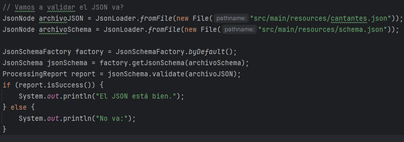
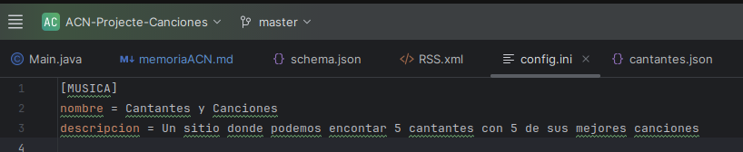
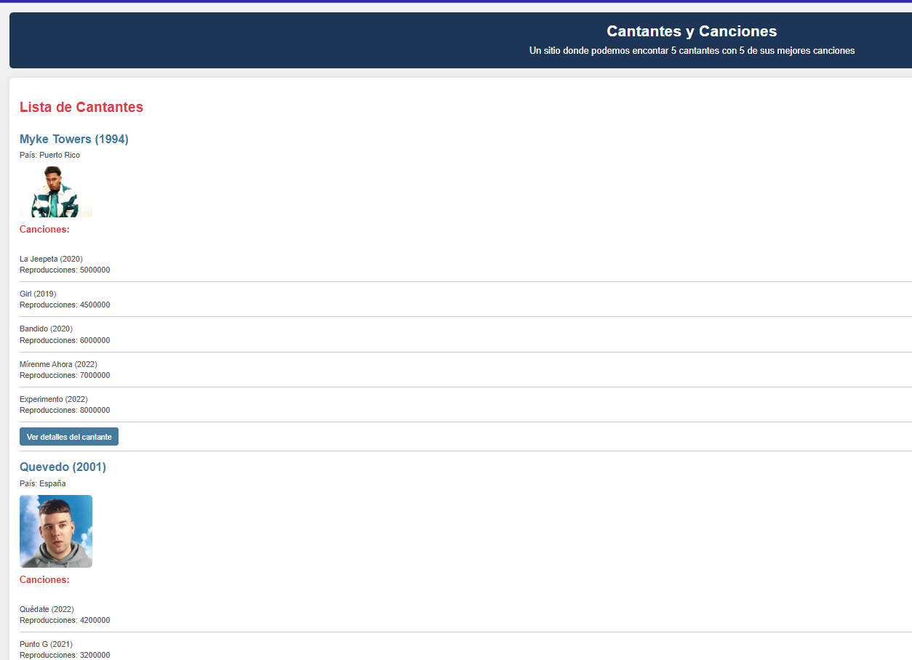
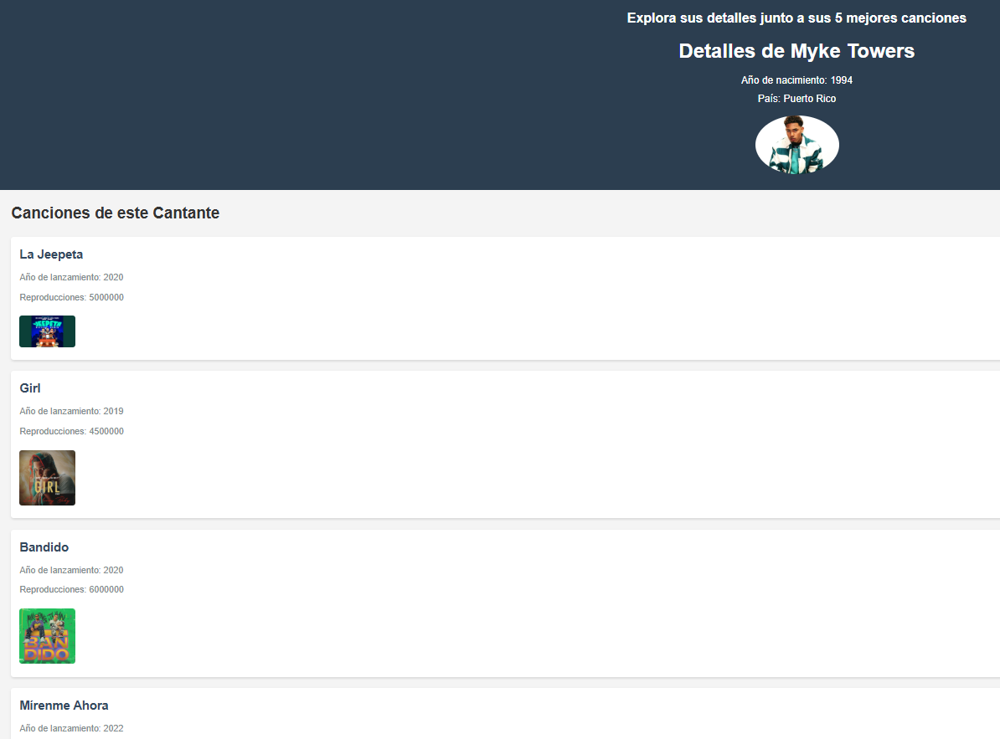
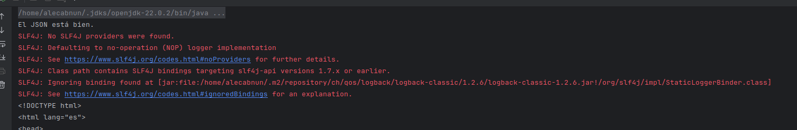

# Memoria del Proyecto: Generador de Pàgines Web Estàtiques - Cantantes con Canciones -

## Portada

**Título:** Generador de Pàgines Web Estàtiques sobre Cantantes con sus canciones  
**Autor:** Alejandro Caballero Núñez  
**Fecha:** 03 de noviembre de 2024

---

## Índice
1. [Introcucción](#1-introcucción)
2. [Descripción del Proyecto](#2-descripción del proyecto)
3. [Ficheros de Entrada](#3-ficheros de entrada)
    - [Archivo JSON](#31-archivo-json)
    - [Archivo JSON Schema](#32-archivo-json-schema)
    - [Archivo INI](#33-archivo-ini)
4. [Descripción de Librerias, Clases y Dependencias](#4-descripción-de-librerias-clases-y-dependencias)
5. [Plantillas Thymeleaf](#5-plantillas-thymeleaf)
6. [Fcheros de Salida](#6-ficheos-de-salida)
7. [Problemas Resueltos y No Resueltos](#7-problemas-resueltos-y-no-resueltos)
8. [Webgrafia](#8-webgrafia)

---

## 1. Introcucción
En este proyecto hemos creado un generador automático de páginas web estáticas. De esta manera hemos presentado información sobre cantantes y sus canciones más famosas. Todo esto mediante archivos de entrada incluyendo datos en formato JSON que se validan con un esquema JSON Schema. Luego, estos datos se usan para generar páginas HTML con plantillas Thymeleaf.

Al acabar les he dado formato con dos archivos CSS (uno para cada platilla, dentro de la carpeta de css "src/main/resources/static/css"), de esta manera se observa mucho mejor y se hace más ameno gracas a sus colores y estructura (aunque me sale todos a la izquierda).


---

## 2. Descripción del Proyecto
El proyecto se encarga de leer los archivos de entrada (JSON, INI) y genera páginas web personalizadas con los datos introducidos. Estas páginas muestran detalles sobre cantantes y sus canciones. Los pasos principales utilizados son:

1. Hacemos el archivo JSON y lo validamos mediante el JSON Schema, también coje datos del archivo de config ini.
2. También hemos puesto un pequeño código el cual nos informa si el JSON está bien hecho mediante el schema.

   
3. Generación de páginas HTML utilizando Thymeleaf.
4. Creación de un archivo RSS con las novedades del proyecto.

---

## 3. Archivos de Entrada

### 3.1 Archivo principal JSON
Este archivo contiene la información principal de los cantantes y canciones, organiza los daros y se encarga de 'repositorio de datos', y tiene varios usos, pero en este proyecto, es el que se encarga de proporcionar la informacion que vamos a encontrar en las paginas. 
```json
{
  "cantantes": [
    {
      "nombre": "Myke Towers",
      "añoNacimiento": 1994,
      "pais": "Puerto Rico",
      "imagen": "https://s1.abcstatics.com/abc/www/multimedia/play/2024/05/22/myke-towers-kXj-U6025231639588jD-1200x840@diario_abc.jpg",
      "canciones": [
        {
          "titulo": "La Jeepeta",
          "añoLanzamiento": 2020,
          "reproducciones": 5000000,
          "imagen": "https://i.ytimg.com/vi/r-GBckkgez0/maxresdefault.jpg"
        },
        {
          "titulo": "Girl",
          "añoLanzamiento": 2019,
          "reproducciones": 4500000,
          "imagen": "https://i1.sndcdn.com/artworks-YincwHyDGUTwxSRO-JFaNyA-t500x500.jpg"
        },
        {
          "titulo": "Bandido",
          "añoLanzamiento": 2020,
          "reproducciones": 6000000,
          "imagen": "https://i1.sndcdn.com/artworks-cQ7Kbjjy6SV6-0-t500x500.jpg"
        },
        {
          "titulo": "Mírenme Ahora",
          "añoLanzamiento": 2022,
          "reproducciones": 7000000,
          "imagen": "https://i1.sndcdn.com/artworks-otRiegkMHRLfbUiW-sd1HSg-t500x500.jpg"
        },
        {
          "titulo": "Experimento",
          "añoLanzamiento": 2022,
          "reproducciones": 8000000,
          "imagen": "https://i.ytimg.com/vi/khPFC_3kgpY/maxresdefault.jpg"
        }
      ]
    },
    {
      "nombre": "Quevedo",
      "añoNacimiento": 2001,
      "pais": "España",
      "imagen": "https://rtvc.es/archivos/2023/01/Quevedo-1024x1024.jpg",
      "canciones": [
        {
          "titulo": "Quédate",
          "añoLanzamiento": 2022,
          "reproducciones": 4200000,
          "imagen": "https://i1.sndcdn.com/artworks-JEIh3pHVkLqfygAz-I8j1qg-t500x500.jpg"
        },
        {
          "titulo": "Punto G",
          "añoLanzamiento": 2021,
          "reproducciones": 3200000,
          "imagen": "https://i1.sndcdn.com/artworks-1RZdtuWbNDyPwAQu-CNUwlg-t1080x1080.jpg"
        },
        {
          "titulo": "Ahora y Siempre",
          "añoLanzamiento": 2022,
          "reproducciones": 3500000,
          "imagen": "https://i.ytimg.com/vi/wlPl-rP6j2g/sddefault.jpg"
        },
        {
          "titulo": "Sin Señal",
          "añoLanzamiento": 2021,
          "reproducciones": 2500000,
          "imagen": "https://i1.sndcdn.com/artworks-EqzyAydjzrHcG0q0-aS1Yeg-t500x500.jpg"
        },
        {
          "titulo": "Chamaquita",
          "añoLanzamiento": 2021,
          "reproducciones": 2000000,
          "imagen": "https://i.ytimg.com/vi/OGlrIYOMo_s/sddefault.jpg"
        }
      ]
    },
    {
      "nombre": "Jhayco",
      "añoNacimiento": 1993,
      "pais": "Puerto Rico",
      "imagen": "https://media.revistagq.com/photos/671a1172e681f06e9018c58b/master/w_1600%2Cc_limit/GQHYPE-JHAYCO-WEB.jpg",
      "canciones": [
        {
          "titulo": "No Me Conoce",
          "añoLanzamiento": 2019,
          "reproducciones": 8000000,
          "imagen": "https://i.ytimg.com/vi/Bc8nwtJylxI/maxresdefault.jpg"
        },
        {
          "titulo": "Dákiti",
          "añoLanzamiento": 2020,
          "reproducciones": 8500000,
          "imagen": "https://i.ytimg.com/vi/hEr7CiKax8Q/hq720.jpg?sqp=-oaymwEhCK4FEIIDSFryq4qpAxMIARUAAAAAGAElAADIQj0AgKJD&rs=AOn4CLCbUHJJJqCZNluYMiZFPQgwZWN8LQ"
        },
        {
          "titulo": "En Mi Cuarto",
          "añoLanzamiento": 2021,
          "reproducciones": 7500000,
          "imagen": "https://i1.sndcdn.com/artworks-tO7YE7W6ldDO62rn-6P665w-t500x500.jpg"
        },
        {
          "titulo": "Tarot",
          "añoLanzamiento": 2022,
          "reproducciones": 9000000,
          "imagen": "https://i.ytimg.com/vi/2qutcPzehPE/maxresdefault.jpg"
        },
        {
          "titulo": "Sensual Bebé",
          "añoLanzamiento": 2022,
          "reproducciones": 9500000,
          "imagen": "https://i.ytimg.com/vi/OwhWSNiE1QY/maxresdefault.jpg"
        }
      ]
    },
    {
      "nombre": "Gonzy",
      "añoNacimiento": 1993,
      "pais": "EEUU",
      "imagen": "https://cdn-images.dzcdn.net/images/artist/ab7ef51cfa0cb9f7b04564976173485c/1900x1900-000000-80-0-0.jpg",
      "canciones": [
        {
          "titulo": "X’CLUSIVO",
          "añoLanzamiento": 2023,
          "reproducciones": 1000000,
          "imagen": "https://i1.sndcdn.com/artworks-RvGfzLgzN61FbYAJ-vzTzUw-t500x500.jpg"
        },
        {
          "titulo": "La Jaula",
          "añoLanzamiento": 2024,
          "reproducciones": 1500000,
          "imagen": "https://images.genius.com/de6a78c067b5ef5a3350f6d3f9228405.300x300x1.png"
        },
        {
          "titulo": "La Calma",
          "añoLanzamiento": 2023,
          "reproducciones": 1200000,
          "imagen": "https://i.ytimg.com/vi/e_8EtbrpQPI/hqdefault.jpg"
        },
        {
          "titulo": "EROTICAAAAAAA",
          "añoLanzamiento": 2024,
          "reproducciones": 1700000,
          "imagen": "https://i.ytimg.com/vi/1w-FRnH2F-o/maxresdefault.jpg"
        },
        {
          "titulo": "Friki",
          "añoLanzamiento": 2024,
          "reproducciones": 1600000,
          "imagen": "https://i.ytimg.com/vi/np5po6PlFz0/sddefault.jpg"
        }
      ]
    },
    {
      "nombre": "Lucho RK",
      "añoNacimiento": 2000,
      "pais": "España",
      "imagen": "https://akamai.sscdn.co/uploadfile/letras/fotos/b/2/2/a/b22afed0981f12e75094ffe840d9d20a.jpg",
      "canciones": [
        {
          "titulo": "Caramelo",
          "añoLanzamiento": 2024,
          "reproducciones": 500000,
          "imagen": "https://i.ytimg.com/vi/euy632CE0vs/hq720.jpg?sqp=-oaymwEhCK4FEIIDSFryq4qpAxMIARUAAAAAGAElAADIQj0AgKJD&rs=AOn4CLBmajvQPNBi9AqBFWXrHWR4aMpFzg"
        },
        {
          "titulo": "Big Checks",
          "añoLanzamiento": 2024,
          "reproducciones": 600000,
          "imagen": "https://i.ytimg.com/vi/sHztc81M720/hqdefault.jpg"
        },
        {
          "titulo": "Esos Ojitos",
          "añoLanzamiento": 2024,
          "reproducciones": 550000,
          "imagen": "https://i.ytimg.com/vi/R0_NgkLERS0/hq720.jpg?sqp=-oaymwEhCK4FEIIDSFryq4qpAxMIARUAAAAAGAElAADIQj0AgKJD&rs=AOn4CLDMiFKcQQX9z8LNh3mkFQBrctPQ3w"
        },
        {
          "titulo": "AIAIAI",
          "añoLanzamiento": 2024,
          "reproducciones": 700000,
          "imagen": "https://i.ytimg.com/vi/zX-Ah7TlgsY/maxresdefault.jpg"
        },
        {
          "titulo": "Aquí Estoy",
          "añoLanzamiento": 2024,
          "reproducciones": 1050000,
          "imagen": "https://images.genius.com/8b77c0520ac53c600d84e8296970a81d.1000x1000x1.png"
        }
      ]
    }
  ]
}
```

### 3.2 Archivo JSON Schema
Este archivo su principal próposito es validar la estructura del archivo JSON:
```json
{
  "$schema": "http://json-schema.org/draft-07/schema#",
  "type": "object",
  "properties": {
    "cantantes": {
      "type": "array",
      "items": {
        "type": "object",
        "properties": {
          "nombre": {
            "type": "string",
            "minLength": 1
          },
          "añoNacimiento": {
            "type": "integer",
            "minimum": 1900,
            "maximum": 2024
          },
          "pais": {
            "type": "string",
            "minLength": 1
          },
          "imagen": {
            "type": "string",
            "format": "uri",
            "minLength": 1
          },
          "canciones": {
            "type": "array",
            "items": {
              "type": "object",
              "properties": {
                "titulo": {
                  "type": "string",
                  "minLength": 1
                },
                "añoLanzamiento": {
                  "type": "integer",
                  "minimum": 1900,
                  "maximum": 2024
                },
                "reproducciones": {
                  "type": "integer",
                  "minimum": 0
                },
                "imagen": {
                  "type": "string",
                  "format": "uri",
                  "minLength": 1
                }
              },
              "required": ["titulo", "añoLanzamiento", "imagen"]
            },
            "minItems": 1
          }
        },
        "required": ["nombre", "añoNacimiento", "pais", "imagen", "canciones"]
      }
    }
  },
  "required": ["cantantes"]
}

```

### 3.3 Archivo INI
Este archivo contiene la configuración del proyecto:



---

## 4. Descripción de Librerías, Clases y Dependencias

- **Librerías Utilizadas:**
    - `Jackson`: Para manejar el archivo JSON (con el ObjectMapper).
    - `Thymeleaf`: Esta la usamos para generar los HTML a partir de las plantillas de Cantantes y Canciones (ambas HTML).
    - `JSON-validator`: Esta la usamos para validar el Schema.

- **Dependencias Maven:**
```xml
<dependencies>
    <!--Genera las páginas web HTML a partir de plantillas (Cantantes y Canciones.html)-->
    <dependency>
        <groupId>org.thymeleaf</groupId>
        <artifactId>thymeleaf</artifactId>
        <version>3.1.2.RELEASE</version>
    </dependency>
    <!--Convierte el archivo JSON en objetos Java-->
    <dependency>
        <groupId>com.fasterxml.jackson.core</groupId>
        <artifactId>jackson-databind</artifactId>
        <version>2.18.1</version>
    </dependency>
    <!--La tengo para que salgan mensajes de diagnóstico y no me salga error (imagen)-->
    <dependency>
        <groupId>org.slf4j</groupId>
        <artifactId>slf4j-api</artifactId>
        <version>1.7.32</version>
    </dependency>
    <!--Valida el JSON-->
    <dependency>
        <groupId>com.github.java-json-tools</groupId>
        <artifactId>json-schema-validator</artifactId>
        <version>2.2.14</version>
    </dependency>
    <!--Se encarga de que salgan los mensajes de los logs y no me salgan rojos (sin ella -> error)-->
    <dependency>
        <groupId>ch.qos.logback</groupId>
        <artifactId>logback-classic</artifactId>
        <version>1.2.6</version>
    </dependency>
</dependencies>

```

- **Clases Java:**
    - `Canción`: La clase Cancion tiene atributos titulo, añoLanzamiento, reproducciones e imagen. Utiliza la anotación @JsonProperty para mapear los atributos a claves JSON al hacer la serialización/deserialización.
    - `Cantante`: La clase Cantante tiene atributos nombre, añoNacimiento, pais, imagen y canciones. Utiliza la anotación @JsonProperty para mapear estos atributos a claves JSON para serialización/deserialización.
    - `LiastaDeCantantes`: La clase ListaDeCantantes tiene un atributo cantantes, que es una lista de objetos de la clase Cantante. Utiliza la anotación @JsonProperty para mapear la lista a la clave JSON "cantantes" durante la serialización/deserialización.

---

## 5. Plantillas Thymeleaf
- **Plantilla Principal (`plantillaCantantes.html`):** Esta es la plantilla que se encarga de mostrar los detalles de cada cantante, luego incluye un botón para acceder al cantante y ver sus canciones.  

Plantilla principal ("plantillaCantantes.html"):
```html
<!DOCTYPE html>
<html lang="es" xmlns:th="http://www.thymeleaf.org">
<head>
    <meta charset="UTF-8">
    <title th:text="${nombre}">Mejores Cantantes con sus Canciones</title>
    <link rel="stylesheet" th:href="@{css/apariencia1.css}" />

</head>
<body>
<header>
    <h1 th:text="${nombre}"></h1>
    <p th:text="${descripcion}"></p>
</header>

<!--modificar la plantilla y poner una card cuadros pequeñitos en seciones -->

<main>
    <section>
        <h2>Lista de Cantantes</h2>
        <ul>
            <li th:each="cantante : ${cantantes}">
                <!-- Mostrar el nombre del cantante, año de nacimiento y su imagen -->
                <h3 th:text="${cantante.nombre + ' (' + cantante.añoNacimiento + ')'}"></h3>
                <p>País: <span th:text="${cantante.pais}"></span></p>
                

                <h4>Canciones:</h4>
                <ul>
                    <li th:each="cancion : ${cantante.canciones}">
                        <!-- Mostrar título de cada canción, año de lanzamiento y reproducciones -->
                        <p th:text="${cancion.titulo + ' (' + cancion.añoLanzamiento + ')'}"></p>
                        <p>Reproducciones: <span th:text="${cancion.reproducciones}"></span></p>
                    </li>
                </ul>

                <!-- Enlace a la página de detalles del cantante -->
                <a th:href="@{'detalles_' + ${cantante.nombre} + '.html'}">Ver detalles del cantante</a>
            </li>
        </ul>
    </section>
</main>
</body>
</html>

```

- **Plantilla de Detalles (`plantillaCanciones.html`):** Muestra la información del cantante y sus cinco mejores canciones (indicando los detalles de cada canión).
```html
<!DOCTYPE html>
<html lang="es" xmlns:th="http://www.thymeleaf.org">
<head>
    <meta charset="UTF-8">
    <title>Detalles del Cantante</title>
    <link rel="stylesheet" th:href="@{css/apariencia2.css}" />

</head>
<body>
<header>
    <h2>Explora sus detalles junto a sus 5 mejores canciones</h2>

    <!-- Detalles del cantante -->
    <h1 th:text="'Detalles de ' + ${cantante.nombre}"></h1>
    <p>Año de nacimiento: <span th:text="${cantante.añoNacimiento}"></span></p>
    <p>País: <span th:text="${cantante.pais}"></span></p>
    
</header>

<main>
    <section>
        <h3>Canciones de este Cantante</h3>
        <ul>
            <li th:each="cancion : ${cantante.canciones}">
                <h4 th:text="${cancion.titulo}"></h4>
                <p>Año de lanzamiento: <span th:text="${cancion.añoLanzamiento}"></span></p>
                <p>Reproducciones: <span th:text="${cancion.reproducciones}"></span></p>
                
            </li>
        </ul>
    </section>

    <!-- Enlace de regreso a la página principal -->
    <a href="index.html" class="button">Volver a la página principal</a>
</main>
</body>
</html>


```

---

## 6. Archivos de Salida
Los archivos HTML se generan en la carpeta `src/main/resources/static`:
- `index.html`: Es la página principal donde encontramos los 5 cantantes con sus canciones, debajo de las canciones de cada cantante tenemos un botón 'Ver detalles del cantante', que nos lleva a sus detalles (siguiente archivo de salida).
- `detalles.html`: Cada cantante tiene una página de estas ("detalles_n.cantante.html"), en ella podemos encontar sus detalles y canciones ampliadas con una foto.
- `rss.xml`: Este es un archivo que se encarga de distribuir el contenido de mi página. Es producido gracias a esta función:


### Captura de la página principal


### Captura de uno ejemplo de detalles


---

## 7. Problemas Resueltos y No Resueltos
- **Resueltos:**
    - Añadir la dependencia de slf4j para que no me salgan errores de diagnostico.
    - 
      - Integración de las plantillas con html, ya que se me ejecutaba, pero no me creaba los detalles, a paser de que el proyecto me iba porque tenia los detalles creados yo, no se creaban al ejecutal el main. Al final conseguí poner bien las plantillas.
- **No Resueltos:**
    - Me salen todas las cosas pegadas a la izquierda, todo lo de la derecha está vacío y queda mal, me falta modificar las plantillas para que quede mejor.
    - No he conseguido hacer la parte de ampliación (cache).

---

## 8. Webgrafía
1. **Aprender lo que es un fichero RSS:** [https://ca.wikipedia.org/wiki/RSS](https://ca.wikipedia.org/wiki/RSS)
2. **Recursos para el Thymeleaf:** [https://aules.edu.gva.es/fp/pluginfile.php/7965809/mod_resource/content/4/Exemple%20Thymeleaf.pdf](https://aules.edu.gva.es/fp/pluginfile.php/7965809/mod_resource/content/4/Exemple%20Thymeleaf.pdf)
3. **Encontrar dependencias:** [https://mvnrepository.com/](https://mvnrepository.com/)
4. **Aprender cosas básicas de Markdown:** [https://experienceleague.adobe.com/es/docs/contributor/contributor-guide/writing-essentials/markdown](https://experienceleague.adobe.com/es/docs/contributor/contributor-guide/writing-essentials/markdown)

