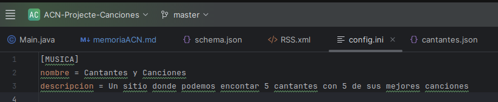

# Memoria del Proyecto: Generador de Pàgines Web Estàtiques - Cantantes con Canciones -

## Portada

**Título:** Generador de Pàgines Web Estàtiques sobre Cantantes con sus canciones  
**Autor:** Alejandro Caballero Núñez  
**Fecha:** 03 de noviembre de 2024

---

## Índice
1. [Introcucción](#1-introcucción)
2. [Descripción del Proyecto](#2-descripción del proyecto)
3. [Ficheros de Entrada](#3-ficheros de entrada)
    - [Archivo JSON](#31-archivo-json)
    - [Archivo JSON Schema](#32-archivo-json-schema)
    - [Archivo INI](#33-archivo-ini)
4. [Descripción de Librerias, Clases y Dependencias](#4-descripción-de-librerias-clases-y-dependencias)
5. [Plantillas Thymeleaf](#5-plantillas-thymeleaf)
6. [Fcheros de Salida](#6-ficheos-de-salida)
7. [Problemas Resueltos y No Resueltos](#7-problemas-resueltos-y-no-resueltos)
8. [Webgrafia](#8-webgrafia)

---

## 1. Introcucción
En este proyecto hemos creado un generador automático de páginas web estáticas. De esta manera hemos presentado información sobre cantantes y sus canciones más famosas. Todo esto mediante archivos de entrada incluyendo datos en formato JSON que se validan con un esquema JSON Schema. Luego, estos datos se usan para generar páginas HTML con plantillas Thymeleaf.

---

## 2. Descripción del Proyecto
El proyecto se encarga de leer los archivos de entrada (JSON, INI) y genera páginas web personalizadas con los datos introducidos. Estas páginas muestran detalles sobre cantantes y sus canciones. Los pasos principales utilizados son:

1. Hacemos el archivo JSON y lo validamos mediante el JSON Schema, también coge datos del archivo de config ini.
2. Generación de páginas HTML utilizando Thymeleaf.
3. Creación de un archivo RSS con las novedades del proyecto.

---

## 3. Archivos de Entrada

### 3.1 Archivo principal JSON
Este archivo contiene la información principal de los cantantes y canciones, organiza los daros y se encarga de 'repositorio de datos', y tiene varios usos, pero en este proyecto, es el que se encarga de proporcionar la informacion que vamos a encontrar en las paginas. 
```json
{
  "cantantes": [
    {
      "nombre": "Myke Towers",
      "añoNacimiento": 1994,
      "pais": "Puerto Rico",
      "imagen": "https://s1.abcstatics.com/abc/www/multimedia/play/2024/05/22/myke-towers-kXj-U6025231639588jD-1200x840@diario_abc.jpg",
      "canciones": [
        {
          "titulo": "La Jeepeta",
          "añoLanzamiento": 2020,
          "reproducciones": 5000000,
          "imagen": "https://i.ytimg.com/vi/r-GBckkgez0/maxresdefault.jpg"
        },
        {
          "titulo": "Girl",
          "añoLanzamiento": 2019,
          "reproducciones": 4500000,
          "imagen": "https://i1.sndcdn.com/artworks-YincwHyDGUTwxSRO-JFaNyA-t500x500.jpg"
        },
        {
          "titulo": "Bandido",
          "añoLanzamiento": 2020,
          "reproducciones": 6000000,
          "imagen": "https://i1.sndcdn.com/artworks-cQ7Kbjjy6SV6-0-t500x500.jpg"
        },
        {
          "titulo": "Mírenme Ahora",
          "añoLanzamiento": 2022,
          "reproducciones": 7000000,
          "imagen": "https://i1.sndcdn.com/artworks-otRiegkMHRLfbUiW-sd1HSg-t500x500.jpg"
        },
        {
          "titulo": "Experimento",
          "añoLanzamiento": 2022,
          "reproducciones": 8000000,
          "imagen": "https://i.ytimg.com/vi/khPFC_3kgpY/maxresdefault.jpg"
        }
      ]
    },
    {
      "nombre": "Quevedo",
      "añoNacimiento": 2001,
      "pais": "España",
      "imagen": "https://rtvc.es/archivos/2023/01/Quevedo-1024x1024.jpg",
      "canciones": [
        {
          "titulo": "Quédate",
          "añoLanzamiento": 2022,
          "reproducciones": 4200000,
          "imagen": "https://i1.sndcdn.com/artworks-JEIh3pHVkLqfygAz-I8j1qg-t500x500.jpg"
        },
        {
          "titulo": "Punto G",
          "añoLanzamiento": 2021,
          "reproducciones": 3200000,
          "imagen": "https://i1.sndcdn.com/artworks-1RZdtuWbNDyPwAQu-CNUwlg-t1080x1080.jpg"
        },
        {
          "titulo": "Ahora y Siempre",
          "añoLanzamiento": 2022,
          "reproducciones": 3500000,
          "imagen": "https://i.ytimg.com/vi/wlPl-rP6j2g/sddefault.jpg"
        },
        {
          "titulo": "Sin Señal",
          "añoLanzamiento": 2021,
          "reproducciones": 2500000,
          "imagen": "https://i1.sndcdn.com/artworks-EqzyAydjzrHcG0q0-aS1Yeg-t500x500.jpg"
        },
        {
          "titulo": "Chamaquita",
          "añoLanzamiento": 2021,
          "reproducciones": 2000000,
          "imagen": "https://i.ytimg.com/vi/OGlrIYOMo_s/sddefault.jpg"
        }
      ]
    },
    {
      "nombre": "Jhayco",
      "añoNacimiento": 1993,
      "pais": "Puerto Rico",
      "imagen": "https://media.revistagq.com/photos/671a1172e681f06e9018c58b/master/w_1600%2Cc_limit/GQHYPE-JHAYCO-WEB.jpg",
      "canciones": [
        {
          "titulo": "No Me Conoce",
          "añoLanzamiento": 2019,
          "reproducciones": 8000000,
          "imagen": "https://i.ytimg.com/vi/Bc8nwtJylxI/maxresdefault.jpg"
        },
        {
          "titulo": "Dákiti",
          "añoLanzamiento": 2020,
          "reproducciones": 8500000,
          "imagen": "https://i.ytimg.com/vi/hEr7CiKax8Q/hq720.jpg?sqp=-oaymwEhCK4FEIIDSFryq4qpAxMIARUAAAAAGAElAADIQj0AgKJD&rs=AOn4CLCbUHJJJqCZNluYMiZFPQgwZWN8LQ"
        },
        {
          "titulo": "En Mi Cuarto",
          "añoLanzamiento": 2021,
          "reproducciones": 7500000,
          "imagen": "https://i1.sndcdn.com/artworks-tO7YE7W6ldDO62rn-6P665w-t500x500.jpg"
        },
        {
          "titulo": "Tarot",
          "añoLanzamiento": 2022,
          "reproducciones": 9000000,
          "imagen": "https://i.ytimg.com/vi/2qutcPzehPE/maxresdefault.jpg"
        },
        {
          "titulo": "Sensual Bebé",
          "añoLanzamiento": 2022,
          "reproducciones": 9500000,
          "imagen": "https://i.ytimg.com/vi/OwhWSNiE1QY/maxresdefault.jpg"
        }
      ]
    },
    {
      "nombre": "Gonzy",
      "añoNacimiento": 1993,
      "pais": "EEUU",
      "imagen": "https://cdn-images.dzcdn.net/images/artist/ab7ef51cfa0cb9f7b04564976173485c/1900x1900-000000-80-0-0.jpg",
      "canciones": [
        {
          "titulo": "X’CLUSIVO",
          "añoLanzamiento": 2023,
          "reproducciones": 1000000,
          "imagen": "https://i1.sndcdn.com/artworks-RvGfzLgzN61FbYAJ-vzTzUw-t500x500.jpg"
        },
        {
          "titulo": "La Jaula",
          "añoLanzamiento": 2024,
          "reproducciones": 1500000,
          "imagen": "https://images.genius.com/de6a78c067b5ef5a3350f6d3f9228405.300x300x1.png"
        },
        {
          "titulo": "La Calma",
          "añoLanzamiento": 2023,
          "reproducciones": 1200000,
          "imagen": "https://i.ytimg.com/vi/e_8EtbrpQPI/hqdefault.jpg"
        },
        {
          "titulo": "EROTICAAAAAAA",
          "añoLanzamiento": 2024,
          "reproducciones": 1700000,
          "imagen": "https://i.ytimg.com/vi/1w-FRnH2F-o/maxresdefault.jpg"
        },
        {
          "titulo": "Friki",
          "añoLanzamiento": 2024,
          "reproducciones": 1600000,
          "imagen": "https://i.ytimg.com/vi/np5po6PlFz0/sddefault.jpg"
        }
      ]
    },
    {
      "nombre": "Lucho RK",
      "añoNacimiento": 2000,
      "pais": "España",
      "imagen": "https://akamai.sscdn.co/uploadfile/letras/fotos/b/2/2/a/b22afed0981f12e75094ffe840d9d20a.jpg",
      "canciones": [
        {
          "titulo": "Caramelo",
          "añoLanzamiento": 2024,
          "reproducciones": 500000,
          "imagen": "https://i.ytimg.com/vi/euy632CE0vs/hq720.jpg?sqp=-oaymwEhCK4FEIIDSFryq4qpAxMIARUAAAAAGAElAADIQj0AgKJD&rs=AOn4CLBmajvQPNBi9AqBFWXrHWR4aMpFzg"
        },
        {
          "titulo": "Big Checks",
          "añoLanzamiento": 2024,
          "reproducciones": 600000,
          "imagen": "https://i.ytimg.com/vi/sHztc81M720/hqdefault.jpg"
        },
        {
          "titulo": "Esos Ojitos",
          "añoLanzamiento": 2024,
          "reproducciones": 550000,
          "imagen": "https://i.ytimg.com/vi/R0_NgkLERS0/hq720.jpg?sqp=-oaymwEhCK4FEIIDSFryq4qpAxMIARUAAAAAGAElAADIQj0AgKJD&rs=AOn4CLDMiFKcQQX9z8LNh3mkFQBrctPQ3w"
        },
        {
          "titulo": "AIAIAI",
          "añoLanzamiento": 2024,
          "reproducciones": 700000,
          "imagen": "https://i.ytimg.com/vi/zX-Ah7TlgsY/maxresdefault.jpg"
        },
        {
          "titulo": "Aquí Estoy",
          "añoLanzamiento": 2024,
          "reproducciones": 1050000,
          "imagen": "https://images.genius.com/8b77c0520ac53c600d84e8296970a81d.1000x1000x1.png"
        }
      ]
    }
  ]
}
```

### 3.2 Archivo JSON Schema
Este archivo su principal próposito es validar la estructura del archivo JSON:
```json
{
  "$schema": "http://json-schema.org/draft-07/schema#",
  "type": "object",
  "properties": {
    "cantantes": {
      "type": "array",
      "items": {
        "type": "object",
        "properties": {
          "nombre": {
            "type": "string",
            "minLength": 1
          },
          "añoNacimiento": {
            "type": "integer",
            "minimum": 1900,
            "maximum": 2024
          },
          "pais": {
            "type": "string",
            "minLength": 1
          },
          "imagen": {
            "type": "string",
            "format": "uri",
            "minLength": 1
          },
          "canciones": {
            "type": "array",
            "items": {
              "type": "object",
              "properties": {
                "titulo": {
                  "type": "string",
                  "minLength": 1
                },
                "añoLanzamiento": {
                  "type": "integer",
                  "minimum": 1900,
                  "maximum": 2024
                },
                "reproducciones": {
                  "type": "integer",
                  "minimum": 0
                },
                "imagen": {
                  "type": "string",
                  "format": "uri",
                  "minLength": 1
                }
              },
              "required": ["titulo", "añoLanzamiento", "imagen"]
            },
            "minItems": 1
          }
        },
        "required": ["nombre", "añoNacimiento", "pais", "imagen", "canciones"]
      }
    }
  },
  "required": ["cantantes"]
}

```

### 3.3 Archivo INI
Este archivo contiene la configuración del proyecto:


---

## 4. Descripción de Librerías, Clases y Dependencias

- **Librerías Utilizadas:**
    - `Jackson`: Para manejar el archivo JSON (con el ObjectMapper).
    - `Thymeleaf`: Esta la usamos para generar los HTML a partir de las plantillas de Cantantes y Canciones (ambas HTML).
    - `JSON-validator`: Esta la usamos para validar el Schema.

- **Dependencias Maven:**
```xml
<dependency>
  <groupId>com.fasterxml.jackson.core</groupId>
  <artifactId>jackson-databind</artifactId>
  <version>2.15.0</version>
</dependency>

```

- **Clases Java:**
    - `Cantante`: Modelo para representar un cantante.
    - `Canción`: Modelo para representar una canción.
    - `GeneradorPaginas`: Clase principal para gestionar la generación de páginas.

---

## 5. Plantillas Thymeleaf
- **Plantilla Principal (`index.html`):** Lista todos los cantantes.
- **Plantilla de Detalles (`detalles.html`):** Muestra información sobre un cantante y sus mejores canciones.

Ejemplo de código Thymeleaf:
```html
<!DOCTYPE html>
<html>
<head>
    <title>Mejores Cantantes</title>
</head>
<body>
<h1 th:text="${config.nombre}"></h1>
<ul>
    <li th:each="cantante : ${cantantes}">
        <a th:href="@{'/cantante/' + ${cantante.nombre}}" th:text="${cantante.nombre}"></a>
    </li>
</ul>
</body>
</html>
```

---

## 6. Archivos de Salida
Los archivos HTML se generan en la carpeta `output/`:
- `index.html`: Lista principal de cantantes.
- `detalles.html`: Una página para cada cantante.

### Captura de ejemplo


---

## 7. Problemas Resueltos y No Resueltos
- **Resueltos:**
    - Validación del JSON con esquemas.
    - Integración de Thymeleaf con el proyecto.
- **No Resueltos:**
    - Automatización de pruebas unitarias para la validación.
    - Errores ocasionales en el RSS por caracteres especiales.

---

## 8. Webgrafía
1. **Documentación JSON Schema:** [https://json-schema.org](https://json-schema.org)
2. **Thymeleaf Tutorials:** [https://www.thymeleaf.org](https://www.thymeleaf.org)
3. **Jackson Documentation:** [https://github.com/FasterXML/jackson](https://github.com/FasterXML/jackson)
4. **Referencias RSS:** [https://www.rssboard.org/rss-specification](https://www.rssboard.org/rss-specification)

